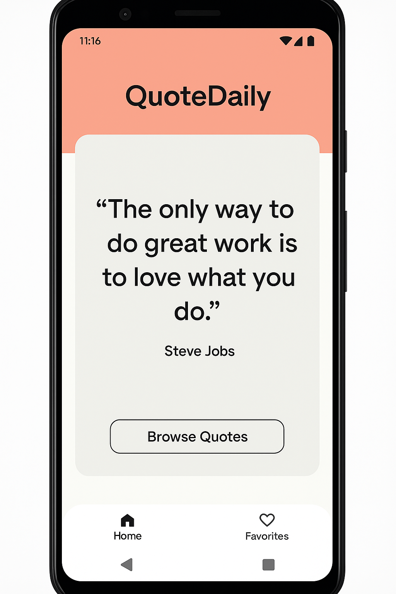
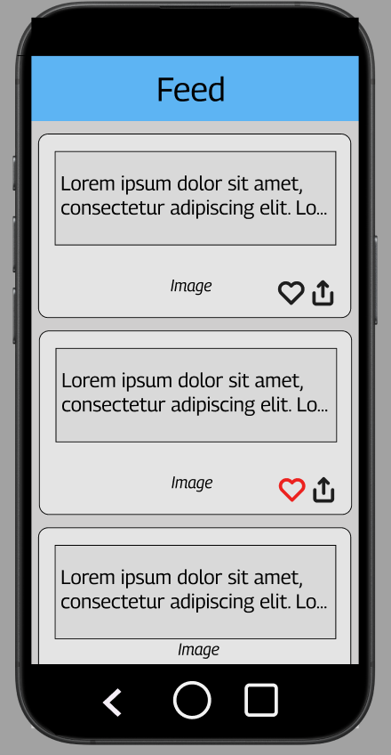
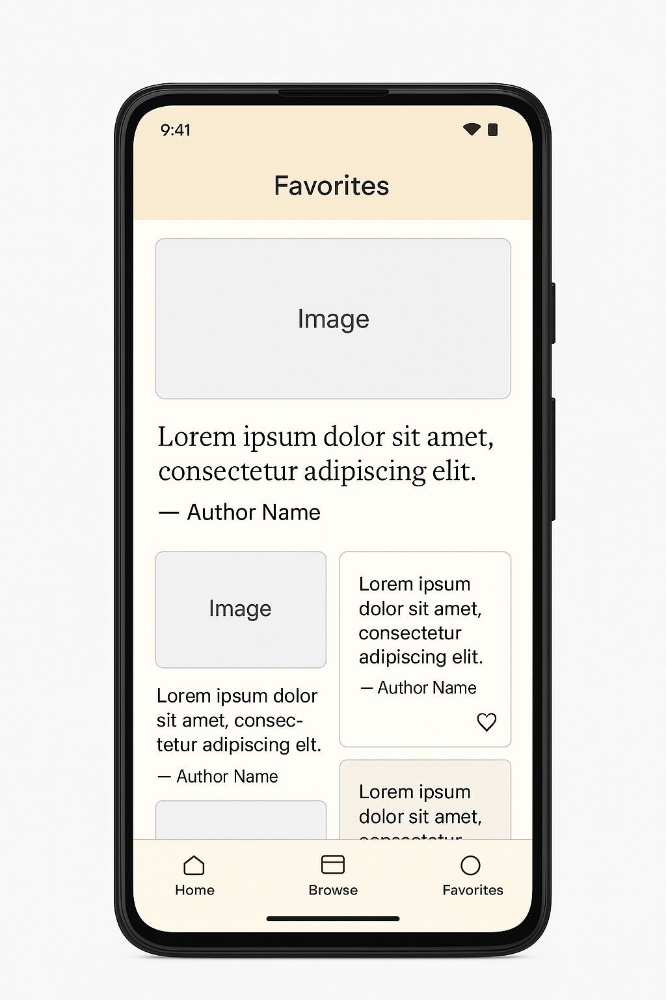
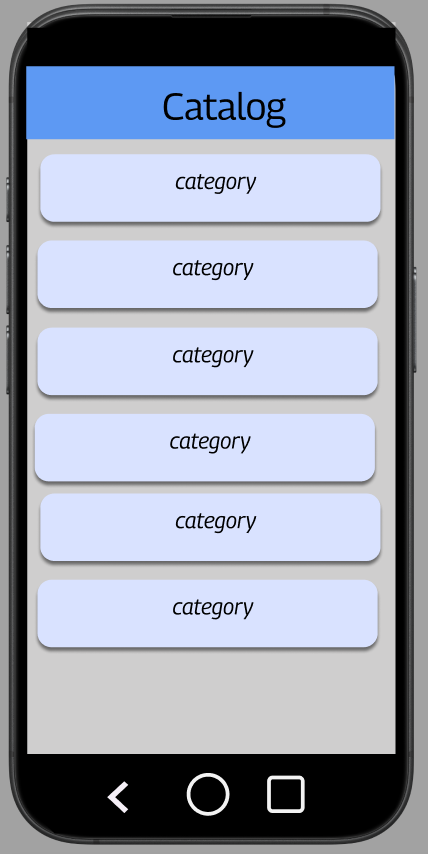
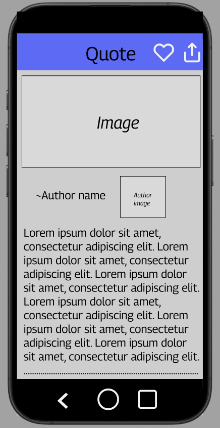

# **QuoteDaily**

## Table of Contents
1. [App Overview](#App-Overview)
1. [Product Spec](#Product-Spec)
1. [Wireframes](#Wireframes)

## App Overview

### Description 
QuoteDaily is a motivational quotes application that delivers daily inspiration through beautiful, shareable quote cards. Users can browse quotes by category, save their favorites for offline access, and share inspiration with friends. The app combines quotes from the Quotable API with stunning background images from Unsplash to create an engaging, distraction-free experience for anyone seeking daily motivation.

### App Evaluation

- **Category:** Lifestyle / Productivity / Entertainment
- **Mobile:** Mobile-first experience with swipe gestures for browsing quotes, push notifications for daily inspiration, and native sharing capabilities. The vertical orientation is perfect for reading and sharing quote cards on social media. Uses device storage for offline favorites access.
- **Story:** Provides a daily dose of inspiration and wisdom for users seeking motivation. Solves the problem of finding quality, ad-free motivational content in one place. Appeals to students, professionals, and social media users who want to share positive messages.
- **Market:** Broad appeal across demographics - students preparing for exams, professionals seeking workplace motivation, fitness enthusiasts, social media influencers, and anyone interested in personal development. Potential user base of millions given the popularity of quote-sharing on social platforms.
- **Habit:** Designed for daily use with fresh daily quotes. Users return multiple times per day to discover new inspiration or share favorites. The favorite collection encourages return visits, and the variety of categories keeps content fresh. Average user session: 2-5 minutes, multiple times daily.
- **Scope:** V1 is clearly defined and achievable within the Unit 8-10 timeline - browse quotes, save favorites, share functionality, and category filtering. Technical implementation is straightforward using free APIs with good documentation. Future versions could add widgets, custom collections, user accounts, and social features, but the core app delivers immediate value.

## Product Spec

### 1. User Features (Required and Optional)

Required Features:

- User can view a featured daily quote with a beautiful background image
- User can browse a feed of quotes displayed in a RecyclerView
- User can filter quotes by category (Wisdom, Life, Success, Love, Inspirational)
- User can save quotes to a favorites collection
- User can view all saved favorite quotes in a separate screen
- User can share quotes to social media or messaging apps
- User can pull-to-refresh to load new quotes
- User can delete quotes from favorites with swipe gesture

Stretch Features:

- User can search quotes by keyword or author name
- User can view quotes from specific authors
- User can set daily notification reminders for inspiration
- User can create custom quote collections/folders
- User can change background themes (light/dark mode)
- User can copy quote text to clipboard with long-press
- User can view quote statistics (most popular, trending)
- User can add personal notes to saved quotes
- User can export favorites as images
- User can customize font styles and sizes

### 2. Chosen API(s)

- **Quotable API** (https://api.quotable.io)
  - Get random quote - displays featured daily quote on home screen
  - Get quotes by category - filters quote feed by selected category tags
  - List all quotes with pagination - populates browse screen RecyclerView
  - Search quotes - enables search functionality (stretch feature)
  - Get author information - displays author details (stretch feature)
  
- **Unsplash API** (https://api.unsplash.com)
  - Get random photo - provides background images for quote cards
  - Search photos by query - matches backgrounds to quote themes
  - Note: Requires free API key registration

### 3. User Interaction

Required Feature 1: Browse Quote Feed

- User can scroll through a RecyclerView of quote cards
- User can tap a category chip to filter quotes by theme
- User can pull down to refresh and load new quotes
- User can tap the favorite icon on any quote card to save it

Required Feature 2: View and Manage Favorites

- User can navigate to Favorites screen via bottom navigation
- User can view all saved quotes in a grid layout
- User can swipe left on any quote card to delete it from favorites
- User can tap a quote to view it full screen

Required Feature 3: Share Quotes

- User can tap the share button on any quote card
- User can select sharing destination (Messages, Instagram, Twitter, etc.)
- Quote is formatted with text and attribution for sharing

## Wireframes:

### Home Screen (Daily Quote)

  

### Browse Screen (Quote Feed)

  

### Favorites Screen

  

### Categories Screen

  

### Quote Screen

  

----
### Bonus Features:

### Digital Wireframes

[View Digital Mockup on Figma](https://www.figma.com/design/VBALH2n7D2su6EK6cuoBoD/droid-wireframes?m=auto&t=Nk9h1Xkio7mDZEvI-1)
